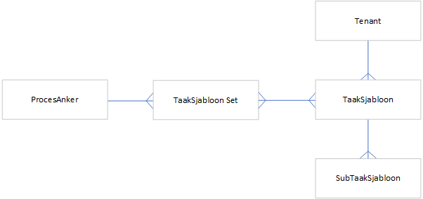

.. *******************************************************************************
   * Metafactory	AM-i Documentatie Taken
   * 
   * samenhang.rst
   *******************************************************************************
   
=========
Samenhang
=========

:numref:`ERD_Taken` Relaties rond taken	
	
Een **ProcesAnker** is een moment in een proces, waarbij er een belangrijke statusovergang plaatsvindt. Dat is een reden om taken uit te zetten voor vervolgacties.

Voorbeelden van processen:
	- Verkoop een gebruikte auto
	- Verkoop een nieuwe auto

Voorbeelden van procesankers:
	- *Overeenkomst gebruikte auto premium*:  SalesOrder Status is Set to Agreement and a Car-OrderLine is present with a reference to a CarStock record with Status Premium
	- *Overeenkomst auto voorraad* : SalesOrder Status is Set to Agreement and a Car-OrderLine is present with a reference to a CarStock record with Status Stock 

Voorbeelden van taken:
	- Vraag rijbewijs van de klant
	- Bestel auto bij importeur
	- Was de auto
	
Aan een procesanker kunnen één of meer taaksjabloon sets hangen.  

Een **TaakSjabloon Set** omvat één of meer TaakSjablonen	
		
Een **TaakSjabloon** is een sjabloon voor één taak.
Een taaksjabloon kan in meerdere taaksjabloon sets voorkomen.

Een **SubTaakSjabloon** is een sjabloon voor een subtaak.
Aan een taaksjabloon kunnen dus meerdere subtaaksjblonen hangen.
	
		
.. include:: referenties.txt